# Compte Rendu — TP1 Kubernetes
**Binôme : Corentin GODON & Matthias DAUVEL**  
**Module : Arthur BARADEL — KUBERNETES**  
**Date : 04 Mai 2026**

---

## Pré-TP — Construction des images Docker du fil rouge

### Objectif
Construire et publier les images Docker du frontend (nginx) et du backend (Flask) sur Docker Hub, afin qu'elles soient accessibles depuis le cluster k3s sans `imagePullSecrets`.

### Architecture cible
- `webapp-backend` : API Flask exposant `/api/messages` (GET/POST) et `/api/health`
- `webapp-frontend` : nginx servant une page HTML statique qui appelle l'API via un proxy `/api/`

### Ce que nous avons fait

Nous avons créé la structure de fichiers suivante :

```text
webapp/
├── frontend/
│   ├── Dockerfile
│   ├── nginx.conf
│   └── html/
│       ├── index.html
│       └── app.js
└── backend/
    ├── Dockerfile
    ├── requirements.txt
    └── app.py
```

Le `nginx.conf` configure un proxy crucial vers le backend — le nom `backend-svc` est résolu par CoreDNS en TP1, et sera remplacé par un Ingress en TP2 :

```nginx
location /api/ {
  proxy_pass http://backend-svc:5000/api/;
  proxy_set_header Host $host;
}
```

### Build et publication

```powershell
$env:DOCKERHUB_USER = "mdprogra"
$env:TAG = "v1.0"

docker build --platform linux/amd64 -t docker.io/$env:DOCKERHUB_USER/webapp-backend:$env:TAG ./backend
docker push docker.io/$env:DOCKERHUB_USER/webapp-backend:$env:TAG

docker build --platform linux/amd64 -t docker.io/$env:DOCKERHUB_USER/webapp-frontend:$env:TAG ./frontend
docker push docker.io/$env:DOCKERHUB_USER/webapp-frontend:$env:TAG
```

### Problème rencontré — Architecture AMD64

Lors du premier build, les images ont été buildées sans préciser la plateforme cible. Les VMs Scaleway étant en `linux/amd64`, les pods tombaient en `ImagePullBackOff` avec l'erreur :

```
no match for platform in manifest: not found
```

**Solution** : rebuild en forçant explicitement la plateforme AMD64 avec `docker buildx` :

```powershell
docker buildx create --use --name mybuilder2
docker buildx inspect --bootstrap
docker buildx build --platform linux/amd64 `
  -t mdprogra/webapp-frontend:v1.2 `
  ./frontend --push --no-cache --progress=plain
docker buildx build --platform linux/amd64 `
  -t mdprogra/webapp-backend:v1.2 `
  ./backend --push --no-cache --progress=plain
```

Les images sont publiées en **public** sur Docker Hub : `https://hub.docker.com/u/mdprogra`

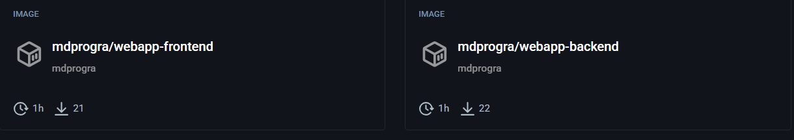

---

## Bloc 1 — Installation du cluster k3s

### Objectif
Installer un cluster k3s multi-nœuds (1 server + 2 agents) et vérifier que tous les nœuds et les pods système sont opérationnels.

### Infrastructure Scaleway

| VM | Hostname | IP publique | Rôle |
|---|---|---|---|
| VM 1 | `GODON-k3s-server` | `212.47.230.56` | Control plane |
| VM 2 | `GODON-k3s-agent-1` | `163.172.161.25` | Worker 1 |
| VM 3 | `GODON-k3s-agent-2` | `212.47.246.29` | Worker 2 |

Toutes les VMs sont sous Ubuntu 26.04, zone PAR-1. Ports `6443/TCP` et `8472/UDP` ouverts entre les VMs.

### Étape 1.1 — Installation du server

Sur **`GODON-k3s-server`** :

```bash
curl -sfL https://get.k3s.io | sh -
sudo systemctl status k3s
sudo kubectl get nodes
```

Récupération du token de jonction :
```bash
sudo cat /var/lib/rancher/k3s/server/node-token
```

### Étape 1.2 — Jonction des agents

Sur **chaque agent** (remplacer `<TOKEN>`) :
```bash
curl -sfL https://get.k3s.io | \
  K3S_URL=https://212.47.230.56:6443 \
  K3S_TOKEN=<TOKEN> \
  sh -
sudo systemctl status k3s-agent
```

### Étape 1.3 — Configuration de kubectl

```bash
mkdir -p ~/.kube
sudo cp /etc/rancher/k3s/k3s.yaml ~/.kube/config
sudo chown $(id -u):$(id -g) ~/.kube/config
chmod 600 ~/.kube/config
echo 'export KUBECONFIG=~/.kube/config' >> ~/.bashrc
source ~/.bashrc
```

### Étape 1.4 — Vérification du cluster

```bash
kubectl get nodes -o wide
kubectl get pods -A
```

Résultat :

```
NAME                STATUS   ROLES           AGE     VERSION
godon-k3s-agent-1   Ready    <none>          4m15s   v1.35.4+k3s1
godon-k3s-agent-2   Ready    <none>          3m26s   v1.35.4+k3s1
godon-k3s-server    Ready    control-plane   6m34s   v1.35.4+k3s1
```


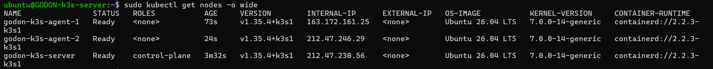

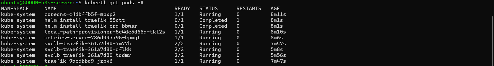

✅ **Checkpoint 1.A** : 3 nœuds en `Ready`. Pods système (`coredns`, `traefik`, `local-path-provisioner`, `metrics-server`) en `Running`.

---

## Bloc 2 — Pods, ReplicaSets, Deployments

### Objectif
Comprendre et utiliser les primitives Pod, ReplicaSet, Deployment. Observer l'auto-réparation, le scaling déclaratif et le rolling update.

### Étape 2.1 — Pod impératif & déclaratif

**1. Pod impératif :**  
Test de création rapide d'un pod en ligne de commande :

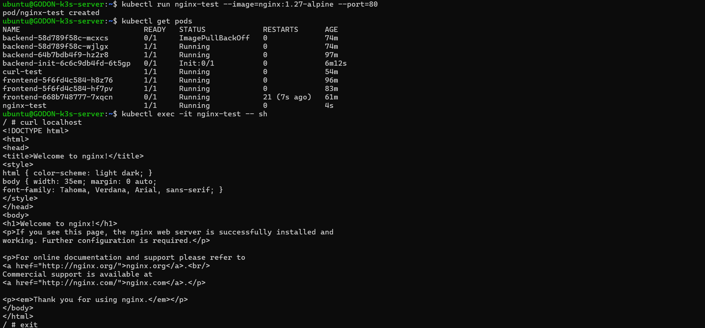

**2. Pod déclaratif (`01-pod.yaml`) :**  
Création d'un pod nginx basique pour comprendre la structure d'un manifest YAML et observer le comportement sans Deployment :

```yaml
apiVersion: v1
kind: Pod
metadata:
  name: nginx-pod
  labels:
    app: demo
spec:
  containers:
  - name: nginx
    image: nginx:1.27-alpine
    ports:
    - containerPort: 80
    resources:
      requests: { cpu: "50m", memory: "64Mi" }
      limits:   { cpu: "200m", memory: "128Mi" }
```

```bash
kubectl apply -f 01-pod.yaml
kubectl get pods -o wide
kubectl describe pod nginx-pod
kubectl exec -it nginx-pod -- sh
kubectl delete -f 01-pod.yaml
```

> Un Pod seul supprimé n'est **pas recréé** — il n'existe pas de contrôleur pour le surveiller. C'est le rôle du Deployment/ReplicaSet.

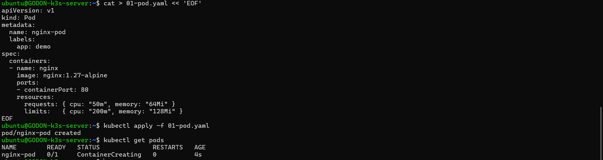

### Étape 2.2 — Deployment frontend (`02-frontend-deploy.yaml`)

Un Deployment gère un ReplicaSet qui maintient le nombre souhaité de pods en vie. Les `readinessProbe` et `livenessProbe` permettent à Kubernetes de vérifier la santé des pods :

```yaml
apiVersion: apps/v1
kind: Deployment
metadata:
  name: frontend
  labels: { app: webapp, tier: front }
spec:
  replicas: 3
  selector:
    matchLabels: { app: webapp, tier: front }
  template:
    metadata:
      labels: { app: webapp, tier: front }
    spec:
      containers:
      - name: frontend
        image: docker.io/mdprogra/webapp-frontend:v1.2
        ports:
        - containerPort: 80
        readinessProbe:
          httpGet: { path: /, port: 80 }
          initialDelaySeconds: 2
        livenessProbe:
          httpGet: { path: /, port: 80 }
          initialDelaySeconds: 5
          periodSeconds: 10
```

```bash
kubectl apply -f 02-frontend-deploy.yaml
kubectl get deploy,rs,pod
kubectl rollout status deploy/frontend
```

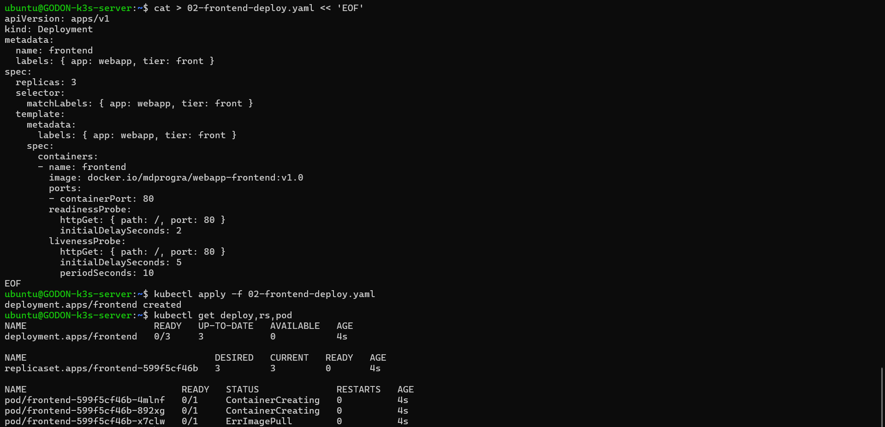

### Étape 2.3 — Auto-réparation

Kubernetes surveille en permanence l'état du cluster via le ReplicaSet controller. Si un pod est supprimé manuellement, il est immédiatement recréé :

```bash
kubectl delete pod frontend-5f6fd4c584-8xbs5
kubectl get pods -l tier=front -w
```

On observe la création du pod de remplacement (`hf7pv`) quasi-instantanément.

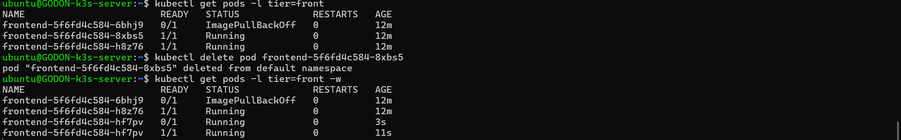

### Étape 2.4 — Scaling

```bash
# Scaling impératif
kubectl scale deploy/frontend --replicas=5
kubectl get pods -l tier=front

kubectl scale deploy/frontend --replicas=2
```

Le scaling est **déclaratif** : on déclare l'état souhaité et Kubernetes s'assure de le respecter. La même opération peut être faite en modifiant `replicas` dans le YAML puis `kubectl apply`.

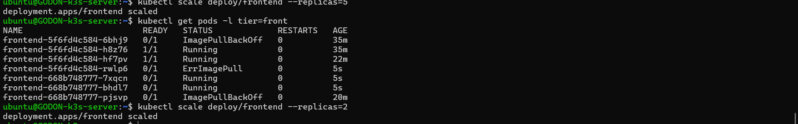

### Étape 2.5 — Rolling update & Rollback

```bash
# Mise à jour de l'image vers v1.1
kubectl set image deploy/frontend frontend=docker.io/mdprogra/webapp-frontend:v1.1
kubectl rollout status deploy/frontend
kubectl rollout history deploy/frontend

# Rollback à la version précédente
kubectl rollout undo deploy/frontend
```

Le rolling update remplace les pods progressivement **sans interruption de service**. Le rollback revient à la révision précédente en utilisant l'historique des ReplicaSets.

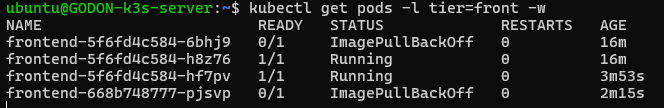

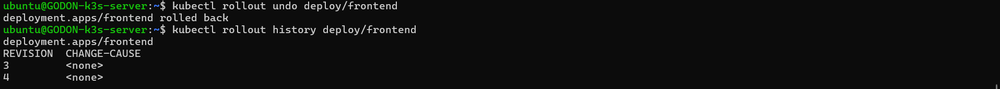

✅ **Checkpoint 2** : 3 puis 5 puis 2 réplicas observés. Suppression manuelle d'un pod → recréation automatique. Rollback fonctionnel.

---

## Bloc 3 — Services et exposition

### Objectif
Exposer les pods via des Services pour permettre la communication interne (ClusterIP) et l'accès depuis l'extérieur du cluster (NodePort).

### Étape 3.1 — Service ClusterIP (`03-frontend-svc.yaml`)

Un Service ClusterIP expose les pods **uniquement à l'intérieur du cluster**, avec une IP virtuelle stable indépendante du cycle de vie des pods. Le selector fait le lien avec les pods via leurs labels :

```yaml
apiVersion: v1
kind: Service
metadata:
  name: frontend-svc
spec:
  type: ClusterIP
  selector: { app: webapp, tier: front }
  ports:
  - port: 80
    targetPort: 80
```

```bash
kubectl apply -f 03-frontend-svc.yaml
kubectl get svc
kubectl describe svc frontend-svc

# Test depuis un pod éphémère
kubectl run curl-test --rm -it --image=curlimages/curl:latest -- sh
# curl http://frontend-svc/
```

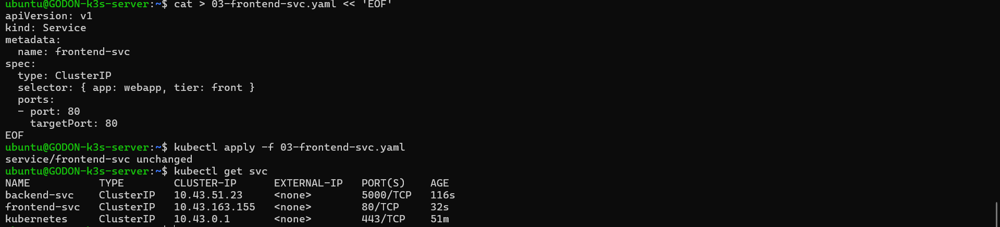

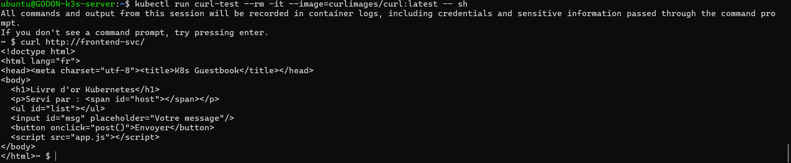

### Étape 3.2 — Service NodePort (`04-frontend-nodeport.yaml`)

Un Service NodePort expose les pods **depuis l'extérieur du cluster** sur un port fixe (30080) de chaque nœud :

```yaml
apiVersion: v1
kind: Service
metadata:
  name: frontend-nodeport
spec:
  type: NodePort
  selector: { app: webapp, tier: front }
  ports:
  - port: 80
    targetPort: 80
    nodePort: 30080
```

Le frontend est accessible sur `http://212.47.230.56:30080`. À ce stade, le frontend s'affiche mais l'API est cassée — le backend n'est pas encore déployé.

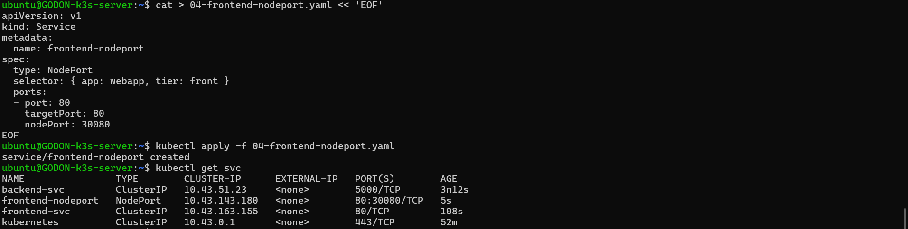

✅ **Checkpoint 3** : Service `ClusterIP` joignable depuis un pod du cluster. Frontend accessible sur `:30080` depuis le réseau.

---

## Bloc 4 — Application multi-tier complète

### Objectif
Déployer le backend Flask, le connecter au frontend via la résolution DNS interne de Kubernetes (CoreDNS), et valider le fonctionnement de bout en bout.

### Étape 4.1 — Backend (`05-backend.yaml`)

Le fichier contient le Deployment et le Service dans un seul manifest (séparés par `---`).  
> ⚠️ Le nom du Service `backend-svc` doit correspondre exactement à celui codé dans `nginx.conf` (`proxy_pass http://backend-svc:5000`).

```yaml
apiVersion: apps/v1
kind: Deployment
metadata:
  name: backend
  labels: { app: webapp, tier: back }
spec:
  replicas: 2
  selector:
    matchLabels: { app: webapp, tier: back }
  template:
    metadata:
      labels: { app: webapp, tier: back }
    spec:
      containers:
      - name: backend
        image: docker.io/mdprogra/webapp-backend:v1.2
        ports:
        - containerPort: 5000
        env:
        - name: APP_ENV
          value: "tp1"
        readinessProbe:
          httpGet: { path: /api/health, port: 5000 }
          initialDelaySeconds: 3
---
apiVersion: v1
kind: Service
metadata:
  name: backend-svc
spec:
  selector: { app: webapp, tier: back }
  ports:
  - port: 5000
    targetPort: 5000
```

```bash
kubectl apply -f 05-backend.yaml
kubectl get pods,svc -l app=webapp
```

### Étape 4.2 — Résolution DNS interne (CoreDNS)

Le nom `backend-svc` dans `nginx.conf` est résolu automatiquement par CoreDNS. Chaque Service Kubernetes reçoit un nom DNS au format :  
`<nom-service>.<namespace>.svc.cluster.local`

```bash
kubectl exec -it <pod-frontend> -- sh
nslookup backend-svc
# → backend-svc.default.svc.cluster.local → 10.43.51.23
wget -qO- http://backend-svc:5000/api/health
```

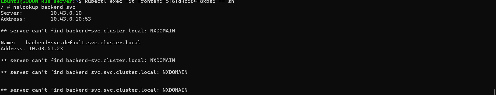

### Étape 4.3 — Test end-to-end

L'application est accessible sur `http://212.47.230.56:30080`. Le livre d'or affiche le nom du pod backend qui répond (`served_by`), ce qui change selon le pod sélectionné par le load balancer — preuve du fonctionnement multi-tier.

```bash
kubectl logs -l tier=back -f
```

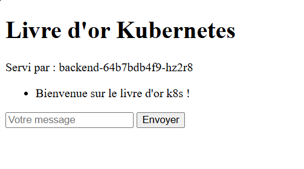

### Problème rencontré — ImagePullBackOff sur agent-2

Le nœud `godon-k3s-agent-2` présentait systématiquement des erreurs `ImagePullBackOff`. Diagnostic :

```bash
kubectl get events --sort-by=.lastTimestamp
kubectl describe pod <pod>
# → Events: Failed to pull image: no match for platform in manifest
kubectl get endpoints backend-svc
```

**Cause** : images buildées sans `--platform linux/amd64`.  
**Solution** : rebuild avec `docker buildx --platform linux/amd64` (cf. Pré-TP).

Le nœud `agent-2` continuait à avoir des problèmes après correction, probablement dû à un cache containerd corrompu. Les pods se sont répartis sur `agent-1` et `server` sans impact sur le fonctionnement global.

✅ **Checkpoint 4** : Application multi-tier fonctionnelle de bout en bout. Au moins une panne diagnostiquée et corrigée.

---

## Bloc 5 — Défis ouverts

### Défi A — Anti-affinité des pods backend

#### Objectif
Garantir que deux pods backend ne soient **jamais schedulés sur le même nœud**. Cela améliore la haute disponibilité : si un nœud tombe, au moins un pod backend reste disponible sur un autre nœud.

#### Concept
L'anti-affinité (`podAntiAffinity`) dit au scheduler Kubernetes : *"ne place pas ce pod sur un nœud où tourne déjà un pod avec ces labels"*.

Il existe deux modes :
- `requiredDuringSchedulingIgnoredDuringExecution` — **strict** : le pod reste en `Pending` si aucun nœud libre
- `preferredDuringSchedulingIgnoredDuringExecution` — **souple** : préférence, non bloquant

Nous utilisons le mode **strict** avec `topologyKey: kubernetes.io/hostname` pour séparer les pods par nœud physique.

#### YAML (`defis/defi-A.yaml`)

```yaml
apiVersion: apps/v1
kind: Deployment
metadata:
  name: backend
  labels: { app: webapp, tier: back }
spec:
  replicas: 2
  selector:
    matchLabels: { app: webapp, tier: back }
  template:
    metadata:
      labels: { app: webapp, tier: back }
    spec:
      affinity:
        podAntiAffinity:
          requiredDuringSchedulingIgnoredDuringExecution:
          - labelSelector:
              matchLabels:
                app: webapp
                tier: back
            topologyKey: kubernetes.io/hostname
      containers:
      - name: backend
        image: docker.io/mdprogra/webapp-backend:v1.2
        ports:
        - containerPort: 5000
        env:
        - name: APP_ENV
          value: "tp1"
        readinessProbe:
          httpGet: { path: /api/health, port: 5000 }
          initialDelaySeconds: 3
---
apiVersion: v1
kind: Service
metadata:
  name: backend-svc
spec:
  selector: { app: webapp, tier: back }
  ports:
  - port: 5000
    targetPort: 5000
```

#### Vérification

```bash
kubectl get pods -o wide -l tier=back
```

Résultat obtenu :

```
NAME                       READY   STATUS    NODE
backend-58d789f58c-wjlgx   1/1     Running   godon-k3s-server
backend-64b7bdb4f9-hz2r8   1/1     Running   godon-k3s-agent-1
```

Les deux pods backend sont bien sur des **nœuds différents** ✅

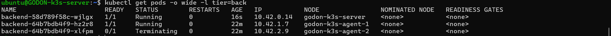

✅ **Défi A validé** : l'anti-affinité garantit la répartition des pods backend sur des nœuds distincts.

### Défi B — Init container

#### Objectif
Ajouter un `initContainer` au backend qui simule l'attente d'une base de données (`postgres-svc`) avant de démarrer l'application principale. Cela montre comment bloquer le démarrage d'un pod tant qu'une dépendance n'est pas prête.

#### Vérification et Logs

L'application backend reste en `Init:0/1` tant que l'initContainer tourne. Une fois terminé, le pod passe en `Running`.


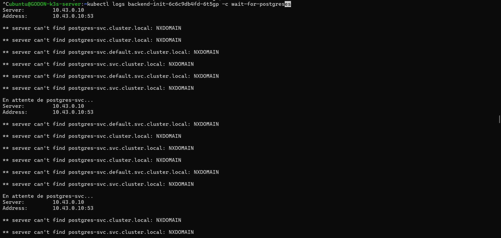

✅ **Défi B validé** : l'initContainer s'exécute correctement et loggue son statut avant de laisser le conteneur principal démarrer.

### Défi C — Multi-conteneurs (Sidecar)

#### Objectif
Modifier le pod frontend pour ajouter un conteneur *sidecar* (`busybox`) qui lit en temps réel (`tail -f`) les logs de nginx via un volume partagé.

#### Vérification et Logs

Le pod frontend s'affiche désormais avec `2/2` conteneurs prêts (le serveur nginx + le sidecar).

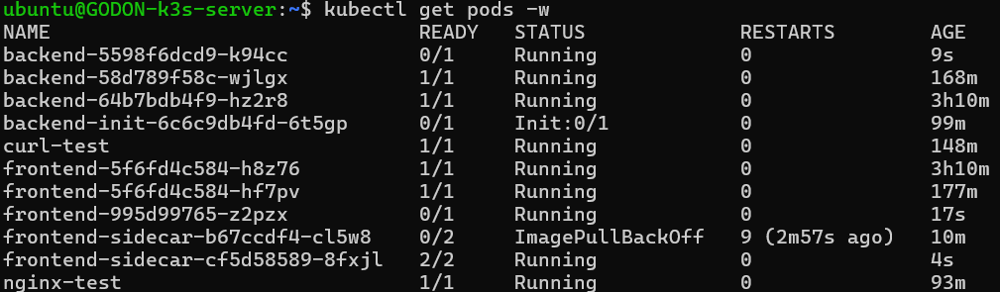

En interrogeant spécifiquement les logs du deuxième conteneur, on obtient bien les logs d'accès nginx :

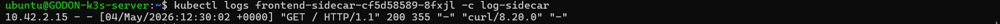

✅ **Défi C validé** : le conteneur sidecar tourne correctement dans le même pod que le frontend et accède aux logs partagés.

---

## Synthèse des commandes clés

| Commande | Description |
|---|---|
| `kubectl apply -f <fichier>` | Appliquer un manifest YAML |
| `kubectl get deploy,rs,pod` | Lister les ressources principales |
| `kubectl get pods -o wide -w` | Observer les pods en temps réel avec le nœud |
| `kubectl describe pod <pod>` | Détails et événements d'un pod |
| `kubectl logs <pod> --previous` | Logs du conteneur précédent (après crash) |
| `kubectl exec -it <pod> -- sh` | Shell dans un pod |
| `kubectl scale deploy/<nom> --replicas=N` | Scaling impératif |
| `kubectl rollout status deploy/<nom>` | Suivre un déploiement |
| `kubectl rollout undo deploy/<nom>` | Rollback |
| `kubectl rollout history deploy/<nom>` | Historique des révisions |
| `kubectl get events --sort-by=.lastTimestamp` | Événements triés par date |
| `kubectl get endpoints <svc>` | Vérifier les endpoints d'un Service |
| `kubectl get svc` | Lister les services |

---

## Pièges rencontrés

| Symptôme | Cause | Résolution |
|---|---|---|
| `ImagePullBackOff` | Images buildées sans `--platform linux/amd64` | Rebuild avec `docker buildx --platform linux/amd64` |
| Service sans endpoints | Selector ne correspond pas aux labels des pods | Vérifier `kubectl describe svc` et les labels |
| Frontend affiche mais API échoue | Backend non déployé ou `backend-svc` introuvable | Déployer le backend, vérifier le nom du Service |
| Pod en `Pending` | Ressources insuffisantes ou anti-affinité stricte | `kubectl describe pod` → Events |


---
---

# Compte Rendu — TP2 Kubernetes
**Binôme : Corentin GODON & Matthias DAUVEL**  
**Module : Arthur BARADEL — KUBERNETES**  
**Date : 04 Mai 2026**

---

## Pré-requis — Image backend v2.0

### Contexte

Le TP1 utilisait un backend Flask qui stockait les messages **en mémoire** (perdus à chaque redémarrage). Pour le TP2, le backend doit pouvoir se connecter à une base **PostgreSQL** via la variable d'environnement `DATABASE_URL`. Si celle-ci est absente, il retombe automatiquement en mode mémoire — ce qui assure la rétrocompatibilité avec le TP1.

### Modifications apportées

**`backend/requirements.txt`** — Ajout de `psycopg2-binary` :

```
flask==3.0.3
psycopg2-binary==2.9.9
```

**`backend/app.py`** — Ajout de la logique de connexion Postgres :
- Initialisation d'un pool de connexions via `psycopg2` si `DATABASE_URL` est définie
- Création automatique de la table `messages` au démarrage (`init_db()`)
- Le champ `backend_mode` du JSON retourne `"postgres"` ou `"memory"` selon le mode actif

### Build et push (multi-architecture)

Comme pour le TP1, on cible explicitement `linux/amd64` et `linux/arm64` pour couvrir les VMs Scaleway et les machines de développement (Mac M1/M2) :

```powershell
$env:DOCKERHUB_USER = "mdprogra"

docker buildx build --platform linux/amd64,linux/arm64 `
  -t docker.io/$env:DOCKERHUB_USER/webapp-backend:v2.0 `
  ./backend --push --no-cache
```

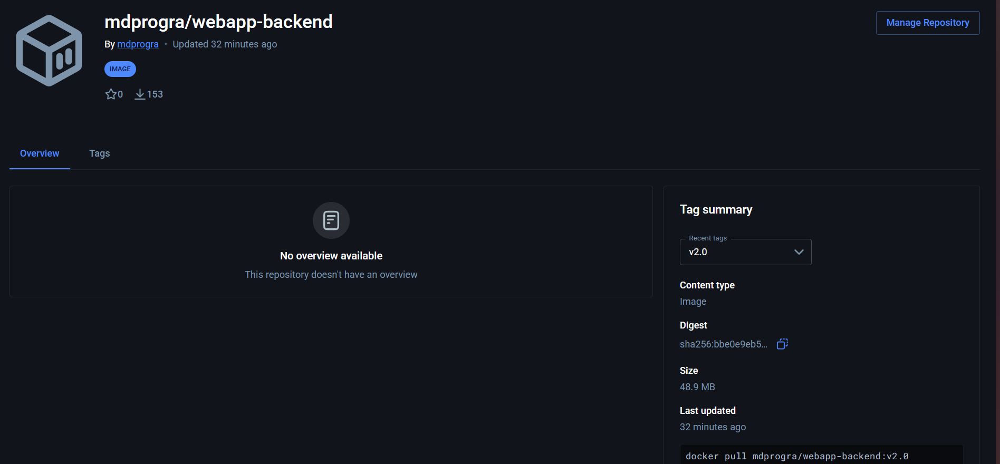

✅ **Pré-requis validé** : l'image `mdprogra/webapp-backend:v2.0` est publiée en **public** sur Docker Hub, accessible pour les deux architectures.


