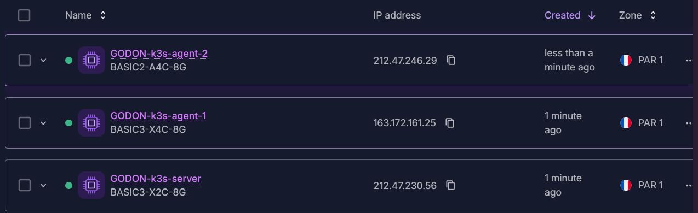

# TP 1 — Bootstrap k3s & fondamentaux Kubernetes - GODON_DAUVEL

## Pré-TP — Construction des images Docker du fil rouge

### Arborescence

```text
/webapp
├───backend
│       app.py
│       Dockerfile
│       requirements.txt
│       
└───frontend
    │   Dockerfile
    │   nginx.conf
    │   
    └───html
            app.js
            index.html
```

### Build et publication

```powershell
$env:DOCKERHUB_USER = "mdaprogra"
$env:TAG = "v1.0"

docker build -t docker.io/$env:DOCKERHUB_USER/webapp-backend:$env:TAG ./backend
docker push docker.io/$env:DOCKERHUB_USER/webapp-backend:$env:TAG

docker build -t docker.io/$env:DOCKERHUB_USER/webapp-frontend:$env:TAG ./frontend
docker push docker.io/$env:DOCKERHUB_USER/webapp-frontend:$env:TAG
```

## Bloc 1 — Installation du cluster k3s

### Pré-requis machines



